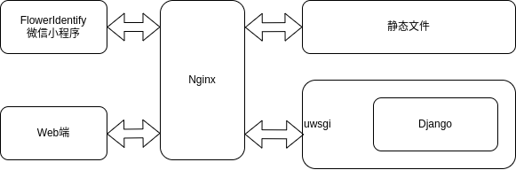

# 简介
FlowerIdentify是一款拍照识花的微信小程序

算法使用了[CCT](https://arxiv.org/abs/2104.05704)模型，基于Flower102数据集开发，可以识别100多种花卉，并且识别精度达到了99.76%（目前最高的识别率）

代码分成两部分：

- 微信小程序FlowerIdentifyApp
- Django开发的后端FlowerIdentify

架构示意图：



# 如何使用

## 微信小程序

将微信小程序代码使用微信小程序开发工具打开即可使用，微信小程序的APPID需要自己申请

因为微信小程序与后台交互必须使用HTTPS协议，所以需要使用Django+uwsgi+Nginx+HTTPS的组合

## Django部署

### Requirement

```text
Django==3.2.7
Pillow==9.3.0
timm==0.4.12
torch==1.9.0+cu111
torchvision==0.10.0+cu111
```

### Install

```bash
pip install -r requirements.txt
```

### Start

**测试是否可以使用**

```bash
python manage.py runserver 0.0.0.0:8000
```

Open url:http://localhost:8000/

**服务器部署：Django+uwsgi+Nginx+HTTPS**

uwsgi启动

```bash
uwsgi --ini uwsgi.ini
```

配置Nginx

```bash
vim /etc/nginx/conf.d/django.conf
```

配置内容如下：

```text
server {
        listen 443 ssl;
        server_name www.example.com;
        charset utf-8;
        client_max_body_size 75M;
        ssl on;
        #ssl证书的pem文件路径
        ssl_certificate  /root/card/example.com.pem;
        #ssl证书的key文件路径
        ssl_certificate_key /root/card/example.com.key;
        location /static {
                alias /root/FlowerIdentify/static;
        }
        location / {
                include uwsgi_params;
                uwsgi_pass 127.0.0.1:8080;
                uwsgi_ignore_client_abort on;
        }
}
```

# 样例程序

微信小程序：


Web端

https://www.gyberpunk.top
